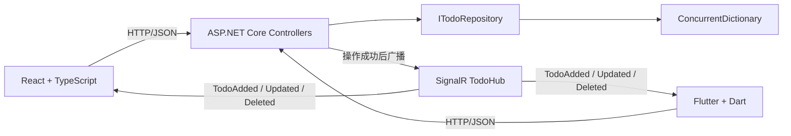

# TodoDemo 架构、设计思路与多语言最佳实践

本文面向希望同时学习 ASP.NET Core、React/TypeScript、Flutter 与 SignalR 的开发者。它不只说明“代码如何运行”，还解释各层为什么这样设计、哪些规则可以迁移到真实项目，以及这个学习示例刻意没有解决哪些生产问题。

## 1. 项目目标

TodoDemo 用一个很小的业务领域展示完整的数据闭环：

- ASP.NET Core 提供 REST API，负责 Todo 的查询和状态变更。
- SignalR 在变更完成后广播事件，让多个客户端尽快看到变化。
- React + TypeScript 提供浏览器客户端。
- Flutter 提供桌面、移动端和 Web 客户端。
- 三端共享同一份 JSON 契约，但分别遵守 C#、TypeScript 和 Dart 的语言习惯。

核心原则是：

> REST 返回值是一次写操作是否成功的权威结果；SignalR 是加速其他客户端同步的通知通道，不是唯一数据来源。

如果客户端只等待 SignalR 事件来更新自己的写操作，一旦实时连接短暂断开，服务器虽然已经写入成功，界面却不会变化。因此两个客户端都会先使用 REST 返回值更新本地状态，再以幂等方式处理 SignalR 事件。重连后再执行一次全量查询，用服务器快照纠正任何遗漏。

## 2. 总体架构



职责边界如下：

| 组件 | 负责 | 不负责 |
| --- | --- | --- |
| Controller | HTTP 语义、输入验证、调用仓储、广播事件 | 保存内部集合、渲染 UI |
| Repository | Todo 状态和并发安全 | HTTP 状态码、SignalR |
| SignalR Hub | 建立实时消息通道 | 持久化、业务状态 |
| Web API 模块 | 请求、状态码检查、运行时 JSON 校验 | React 状态 |
| React 组件/Hook | UI 状态、Effect 生命周期、实时事件合并 | 服务器持久化 |
| Flutter Repository | HTTP 传输和 JSON 解析 | Widget 生命周期 |
| Flutter Realtime Service | 将 SignalR 回调转换为类型化 Stream | 页面渲染 |
| Flutter Widget | 状态展示、用户交互、资源释放 | 拼装 HTTP 请求 |

这种拆分并不是为了追求“层数”，而是为了让每个模块只有一个主要变化原因。例如将来把内存仓储替换为 EF Core 时，Controller 和两个客户端的接口无需改变。

## 3. 跨语言数据契约

服务器模型：

```csharp
public sealed record Todo(Guid Id, string Title, bool IsDone);
```

JSON 示例：

```json
{
  "id": "fcb3b416-79db-4c45-a971-e6221320fd64",
  "title": "理解 SignalR 重连",
  "isDone": false
}
```

关键约定：

| 字段 | JSON 类型 | C# | TypeScript | Dart |
| --- | --- | --- | --- | --- |
| `id` | string | `Guid` | `string` | `String` |
| `title` | string | `string` | `string` | `String` |
| `isDone` | boolean | `bool` | `boolean` | `bool` |

早期代码把前端 ID 声明为数字，但后端实际发送 GUID 字符串。这种错误可以通过编译，因为网络边界上的 JSON 默认不受 TypeScript 或 Dart 静态类型保护；它只会在拼接 URL、比较 ID 或解析事件时暴露。

因此，本项目在两种客户端中都显式验证外部数据：

- TypeScript 先把 `response.json()` 当作 `unknown`，再由 `parseTodo` 缩窄类型。
- Dart 的 `Todo.fromJson(Object?)` 检查 Map 以及每个字段的运行时类型。
- 不使用强制类型断言来“说服”编译器，因为断言不会改变服务器真实返回的数据。

## 4. REST API 设计

| 方法 | 路径 | 成功状态 | 说明 |
| --- | --- | --- | --- |
| GET | `/api/todos` | 200 | 获取服务器快照 |
| GET | `/api/todos/{id}` | 200 | 获取单条 Todo |
| POST | `/api/todos` | 201 | 创建 Todo，返回对象和可访问的 Location |
| PUT | `/api/todos/{id}/toggle` | 200 | 切换完成状态并返回新对象 |
| DELETE | `/api/todos/{id}` | 204 | 删除成功，无响应体 |
| GET | `/health` | 200 | 简单存活检查 |

输入规则：

- `title` 必填。
- 长度为 1–200 个字符。
- 仅包含空白字符的标题无效。
- 写入前进行 `Trim`，避免保存无意义的首尾空格。
- 不存在的 GUID 返回 404。
- 非法模型由 `[ApiController]` 生成标准验证响应。

`CreatedAtAction` 指向真实存在的单条查询接口。只返回一个看似正确、实际无法 GET 的 Location 会违反 201 响应所表达的资源语义。

## 5. 一次写操作的完整流程

以“新增 Todo”为例：

1. 客户端校验标题并发送 POST。
2. Controller 再次执行服务端验证；客户端校验不能替代服务端校验。
3. Repository 生成 GUID 并保存不可变 Todo。
4. Controller 广播 `TodoAdded`。
5. Controller 返回 201、Location 和 Todo JSON。
6. 发起请求的客户端使用 HTTP 返回对象执行 upsert。
7. 其他在线客户端收到 SignalR 事件后执行同一个 upsert。
8. 如果发起请求的客户端也收到自己的广播，upsert 会替换同 ID 对象，不会重复添加。
9. 实时连接重建后，客户端重新 GET 全量列表以消除事件遗漏。

“upsert + 重连刷新”让实时消息具备幂等性，并承认网络事件可能重复、延迟或丢失。生产系统如果要求严格事件交付，还需要消息持久化、序列号或 Outbox，而不仅是 SignalR 广播。

## 6. C# / ASP.NET Core 最佳实践

### 6.1 用 record 表达不可变数据

Todo 是以数据为主的值对象，使用 `sealed record` 可以获得：

- init-only 属性；
- 按值比较；
- 清晰的 `ToString`；
- 通过 `with` 创建修改后的副本。

切换状态时创建新对象，而不是让共享对象在多个线程中原地变更。这使并发推理和事件传递更简单。

### 6.2 依赖倒置，但避免无意义抽象

Controller 依赖 `ITodoRepository`，而不是 `ConcurrentDictionary`。接口确实隔离了一个会变化的边界：存储方式。将来可替换为数据库实现，测试也可以传入假实现。

不需要给每个只有一行且不会变化的辅助函数都创建接口。抽象应围绕变化点和测试边界，而不是机械增加文件数。

### 6.3 使用 Compare-And-Swap 保证并发切换

`ConcurrentDictionary` 只能保证单次字典操作线程安全。下面这种复合操作仍可能丢更新：

1. 读取旧对象；
2. 计算新对象；
3. 用索引器覆盖。

两个线程可能读取同一个旧值，然后写入相同的新值。仓储使用 `TryUpdate(id, updated, current)` 循环：只有字典中的值仍等于刚读取的 `current` 时才更新，否则重新读取并计算。这是乐观并发的 Compare-And-Swap 思路。

测试并行执行 1,000 次 toggle；偶数次切换后结果必须仍为 false。

### 6.4 使用标准 HTTP 语义

Controller 返回 `ActionResult<T>`，明确区分 200、201、204、400 和 404。状态码不是装饰信息；客户端会根据它判断是否解析响应体、是否重试以及显示何种错误。

### 6.5 精确配置 CORS

旧实现使用字符串 `StartsWith` 判断 localhost，类似 `http://localhost.evil.example` 的 Origin 也可能通过。现在使用配置中的完整 Origin 白名单。

注意：

- Origin 包含 scheme、host 和 port。
- `AllowCredentials` 不能与任意 Origin 混用。
- 原生 Flutter HTTP 不受浏览器 CORS 限制；Flutter Web 受限制。
- Vite 开发环境通过反向代理访问同源路径，减少本地 CORS 摩擦。
- 生产环境应配置真实 HTTPS Origin，不能照搬开发白名单。

### 6.6 结构化日志与异常边界

Serilog 通过 Host 集成读取配置，并记录 HTTP 请求。业务代码继续依赖标准 `ILogger<T>`，避免与具体日志库耦合。

生产环境启用 Problem Details 异常处理；开发环境保留 Swagger。日志应描述发生了什么，不应记录密码、Token、个人邮箱或完整敏感请求体。

### 6.7 非托管资源必须放在 finally 中释放

`BrandingFormatString` 返回非托管指针。字符串转换也可能抛异常，因此 `GlobalFree` 必须放在 `finally` 中。只把释放逻辑写在正常路径会造成异常路径内存泄漏。

### 6.8 SDK 与依赖管理

`global.json` 固定到 .NET 10 的 300 feature band，并允许同 feature band 的最新补丁版本。这样既避免每台机器选到不同主版本，也能接收补丁修复。

ASP.NET Core SignalR 服务端已经包含在共享框架中，不应再引用旧的 `Microsoft.AspNetCore.SignalR 1.x` 包。未使用的 Newtonsoft.Json 也已移除。项目将编译警告视为错误，防止警告长期积累。

## 7. TypeScript / React 最佳实践

### 7.1 静态类型不能验证网络

`const todo = await response.json() as Todo` 只是断言，不是验证。安全做法是：

1. 接收 `unknown`；
2. 检查对象、数组和字段；
3. 验证成功后返回 `Todo`。

`any` 会关闭类型检查并向下传播。本项目只在第三方库确实定义为动态回调的边界处理未知值，应用层使用明确类型。

### 7.2 用可辨识联合表示事件

```ts
type TodoEvent =
  | { type: "added"; todo: Todo }
  | { type: "updated"; todo: Todo }
  | { type: "deleted"; id: string };
```

对 `type` 执行 switch 后，TypeScript 会自动缩窄 payload。相比 `(type: string, payload: any)`，它能在编译期阻止把删除 ID 当成 Todo。

### 7.3 Effect 必须可重复执行

React Strict Mode 在开发环境会额外执行一次 setup → cleanup → setup，用来暴露资源泄漏。SignalR Hook 因此遵守以下规则：

- 每次 Effect setup 都创建自己的 connection。
- cleanup 清除启动重试计时器。
- cleanup 注销消息处理器并停止 connection。
- 不用永久的 `startedRef` 阻止第二次 setup。
- 所有响应式依赖都列入依赖数组。
- 父组件用 `useCallback` 提供稳定回调。

`withAutomaticReconnect` 处理已建立连接后的短暂断线；首次 `start()` 失败仍需单独调度重试。自动重连最终耗尽后，`onclose` 再次启动初始连接流程。

### 7.4 状态更新应幂等

新增和更新都通过 `upsertTodo`：

- ID 不存在：追加；
- ID 已存在：替换；
- 同一事件重复到达：结果不变。

HTTP 成功响应立即更新界面，不依赖 SignalR。SignalR 负责其他客户端和补偿同步。每条 Todo 在写操作进行时会禁用按钮，防止用户重复提交同一操作。

### 7.5 处理完整的异步 UI 状态

页面明确展示：

- 初始 loading；
- API error 及重试按钮；
- 添加中状态；
- 单条 Todo pending 状态；
- SignalR connecting / connected / reconnecting / disconnected；
- 空列表状态。

表单使用真实 label、按钮类型和 alert role，键盘焦点也有可见样式。可访问性不是最后补的一层 CSS，而是组件语义的一部分。

### 7.6 环境变量与开发代理

默认使用相对路径 `/api` 和 `/todoHub`。Vite 将它们代理到 `http://localhost:5200`，浏览器看到的是同源请求。

部署前后端分离时可设置：

```powershell
$env:VITE_API_BASE_URL = "https://api.example.com"
npm run build
```

环境变量会进入前端构建产物，不能放任何密钥。

## 8. Dart / Flutter 最佳实践

### 8.1 使用 final、const 和工厂构造函数

Todo 的字段全部是 `final`，构造函数是 `const`。`Todo.fromJson(Object?)` 是明确的信任边界，解析失败抛出 `FormatException`。

Dart 的 sound null safety 能阻止许多空值错误，但不能证明动态 JSON 的字段存在或类型正确，所以仍需要运行时校验。

### 8.2 通过 abstract interface class 定义边界

`TodoRepository` 描述可靠的 REST 操作；`TodoRealtimeService` 描述实时事件和连接状态。Widget 只依赖接口，测试可以注入内存假实现，不会启动真实 HTTP 或 WebSocket。

这是依赖注入最小而直接的形式，不需要为了一个小项目引入服务定位器或状态管理框架。

### 8.3 将回调转换为类型化 Stream

SignalR 包提供字符串事件名和动态参数。适配器将其转换为：

- sealed `TodoEvent` 层次；
- `Stream<TodoEvent>`；
- `Stream<RealtimeStatus>`。

Widget 使用 Dart 3 模式匹配对 sealed event 做穷尽 switch。第三方 SDK 的动态性被限制在一个文件内。

### 8.4 正确处理 Widget 生命周期

所有 await 后、调用 `setState` 前都检查 `mounted`。在 `dispose` 中：

- 取消 StreamSubscription；
- 停止 SignalR；
- 关闭 HTTP Client；
- 释放 TextEditingController。

不能 await 的生命周期方法使用 `unawaited` 明确表示“有意启动但不等待”，比忽略 Future 更易审查。

### 8.5 不可变地更新集合

UI 不直接修改已有 List 元素，而是创建新 List。这能减少多个异步回调共享可变集合时的意外，并使状态变化更容易阅读。

### 8.6 平台网络地址不同

`localhost` 指向“当前运行客户端的设备”：

| Flutter 目标 | API_BASE_URL |
| --- | --- |
| Windows/macOS/Linux 桌面 | `http://localhost:5200` |
| iOS Simulator | 通常可用 `http://localhost:5200` |
| Android Emulator | `http://10.0.2.2:5200` |
| 真机 | 开发机的局域网 IP，例如 `http://192.168.1.10:5200` |
| Flutter Web | `http://localhost:5200`，并固定 Web 端口 8080 |

使用 ```powershell
flutter run --dart-define=API_BASE_URL=http://10.0.2.2:5200
```

Android 主清单包含 INTERNET 权限。本地 API 使用 HTTP，因此只有 debug 清单允许 cleartext；发布版本应使用 HTTPS，不应放宽明文传输策略。

## 9. 三种语言的实践对照

| 主题 | C# | TypeScript | Dart |
| --- | --- | --- | --- |
| 不可变数据 | `record` + `with` | readonly 类型可选；更新时复制数组/对象 | `final` 字段 + 新建对象 |
| 空值安全 | Nullable Reference Types | `strictNullChecks` | Sound null safety |
| 外部动态数据 | System.Text.Json 模型绑定和验证 | `unknown` + type guard/parser | `Object?` + factory parser |
| 异步 | `Task` / `async` / `await` | `Promise` / `async` / `await` | `Future` / `async` / `await` |
| 事件流 | SignalR typed client interface | 可辨识联合 + Hook | sealed class + Stream |
| 资源释放 | `using` / `finally` / Host 生命周期 | Effect cleanup / Abort / clearTimeout | `dispose` / cancel / close |
| 并发重点 | 多线程共享内存、CAS | UI 竞态、陈旧闭包、重复 Effect | isolate 模型，但异步回调仍会交错 |
| 依赖注入 | 内建 DI 容器 | 函数、模块和 Context，按需使用 | 构造函数注入 |
| 静态检查 | 编译器 + warnings as errors | TypeScript strict + ESLint | analyzer + flutter_lints |

共同原则比语法更重要：

- 在系统边界验证输入。
- 把不可恢复的编程错误和可展示的运行时错误分开。
- 让资源的创建和释放成对出现。
- 不依赖事件“恰好只来一次”。
- 让函数签名表达真实类型，不用 `any`、强制 cast 或 null-forgiving 掩盖问题。
- 自动格式化、静态检查和测试必须能在命令行重复运行。

## 10. 本地运行

### 10.1 前置环境

- .NET SDK 10.0.300 feature band 或兼容补丁版本。
- Node.js 与 npm。
- Flutter 3.35.x / Dart 3.9.x 或满足 `pubspec.yaml` 的兼容稳定版本。

确认环境：

```powershell
dotnet --info
node --version
npm --version
flutter doctor
```

### 10.2 启动后端

在仓库根目录：

```powershell
dotnet run --project TodoDemo/TodoDemo.csproj --launch-profile http
```

地址：

- API：`http://localhost:5200/api/todos`
- SignalR：`http://localhost:5200/todoHub`
- Swagger：`http://localhost:5200/swagger`
- Health：`http://localhost:5200/health`

### 10.3 启动 React

另开终端：

```powershell
npm --prefix TodoDemo/web ci
npm --prefix TodoDemo/web run dev
```

浏览器打开 `http://127.0.0.1:3000`。

### 10.4 启动 Flutter

桌面：

```powershell
Set-Location TodoDemo/app
flutter run -d windows
```

Android Emulator：

```powershell
Set-Location TodoDemo/app
flutter run -d android --dart-define=API_BASE_URL=http://10.0.2.2:5200
```

Flutter Web：

```powershell
Set-Location TodoDemo/app
flutter run -d chrome --web-port=8080 --dart-define=API_BASE_URL=http://localhost:5200
```

## 11. 验证命令

在仓库根目录依次运行：

```powershell
dotnet build TodoDemo.slnx --nologo
dotnet test --solution TodoDemo.slnx --no-restore
dotnet list TodoDemo/TodoDemo.csproj package --vulnerable --include-transitive

npm --prefix TodoDemo/web ci
npm --prefix TodoDemo/web run lint
npm --prefix TodoDemo/web run build
npm --prefix TodoDemo/web audit --omit=dev

Set-Location TodoDemo/app
dart format --output=none --set-exit-if-changed lib test
flutter analyze
flutter test
```

.NET 10 使用 Microsoft Testing Platform 时，解决方案参数采用 `dotnet test --solution TodoDemo.slnx`。把解决方案路径直接写成旧式位置参数会走不同的命令解释方式。

## 12. 安全与隐私

当前已采取的措施：

- CORS 使用精确 Origin 白名单。
- 发布构建不允许 Android 明文 HTTP。
- API 限制标题长度并拒绝空白标题。
- 客户端不信任外部 JSON。
- NuGet 与 npm 生产依赖可执行漏洞扫描。
- Git hooks 会阻止非 GitHub noreply 邮箱进入提交和推送历史。
- 新设备克隆后必须运行根目录的 `setup-git-hooks.ps1`。

仍需注意：

- 本项目没有用户认证和授权，不应直接公开部署为可写服务。
- `AllowedHosts: "*"` 适合本地学习；部署时应限定主机。
- Swagger 只在 Development 环境启用。
- 不要在源码、环境变量前端前缀、日志或提交信息中写入密钥和私人邮箱。
- 真正上线时使用 HTTPS、反向代理、速率限制和安全响应头。

## 13. 当前限制

这是学习项目，不是完整生产架构：

1. 数据只存在内存中，服务重启后清空。
2. 多实例部署时，每个实例有独立字典，状态不一致。
3. SignalR 广播没有持久化，离线期间事件可能丢失。
4. 没有用户、权限、审计和多租户隔离。
5. 后端测试主要覆盖仓储并发；尚未加入完整 HTTP/SignalR 集成测试。
6. Web 尚未加入组件测试和端到端测试。
7. Flutter SignalR 使用第三方 Dart 包，升级前应审查维护状态和兼容性。
8. Todo 没有版本号，无法检测两个用户同时编辑同一字段的业务冲突。

## 14. 推荐的后续练习

按学习价值排序：

1. 用 EF Core + SQLite 实现第二个 `ITodoRepository`。
2. 为 Controller 添加 `WebApplicationFactory` 集成测试。
3. 为 React 添加 Vitest + Testing Library。
4. 使用 Playwright 验证两个浏览器窗口的实时同步。
5. 给 Todo 增加描述、创建时间和并发版本。
6. 增加 ASP.NET Core Identity 或外部 OIDC 登录。
7. 使用用户 ID 对 SignalR 分组，避免向所有用户广播。
8. 加入 GitHub Actions，在 PR 上运行三端检查。
9. 用 OpenAPI 生成客户端类型，并保留运行时解析。
10. 为事件加入序号，重连时按序号拉取遗漏变化。

## 15. 官方延伸阅读

- [C# record types](https://learn.microsoft.com/en-us/dotnet/csharp/fundamentals/types/records)
- [ASP.NET Core CORS](https://learn.microsoft.com/en-us/aspnet/core/security/cors?view=aspnetcore-10.0)
- [ASP.NET Core SignalR JavaScript client](https://learn.microsoft.com/en-us/aspnet/core/signalr/javascript-client?view=aspnetcore-10.0)
- [Use hubs in ASP.NET Core SignalR](https://learn.microsoft.com/en-us/aspnet/core/signalr/hubs?view=aspnetcore-10.0)
- [React useEffect](https://react.dev/reference/react/useEffect)
- [React exhaustive-deps](https://react.dev/reference/eslint-plugin-react-hooks/lints/exhaustive-deps)
- [TypeScript type compatibility and unknown](https://www.typescriptlang.org/docs/handbook/type-compatibility)
- [Effective Dart](https://dart.dev/effective-dart)
- [MSTest SDK configuration](https://learn.microsoft.com/en-us/dotnet/core/testing/unit-testing-mstest-sdk)
